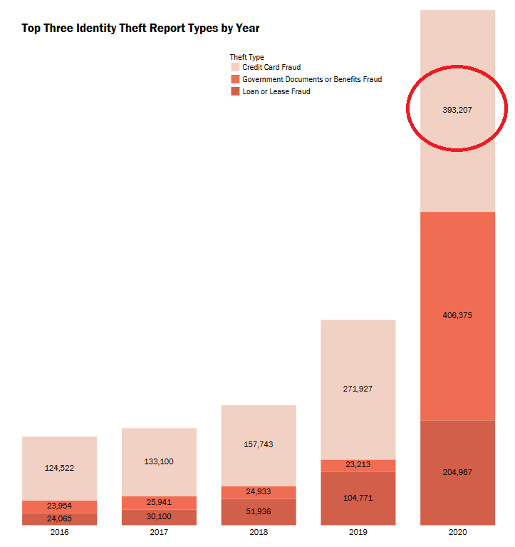
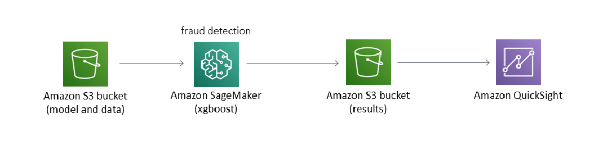
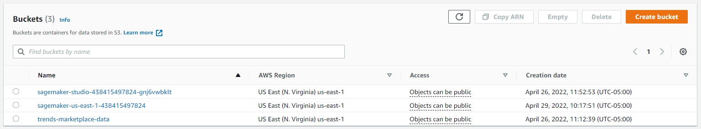
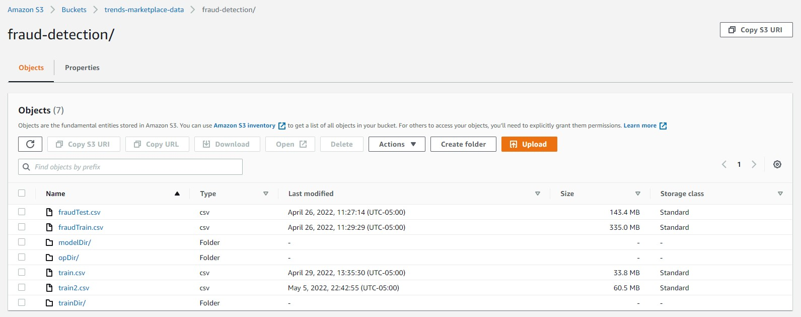
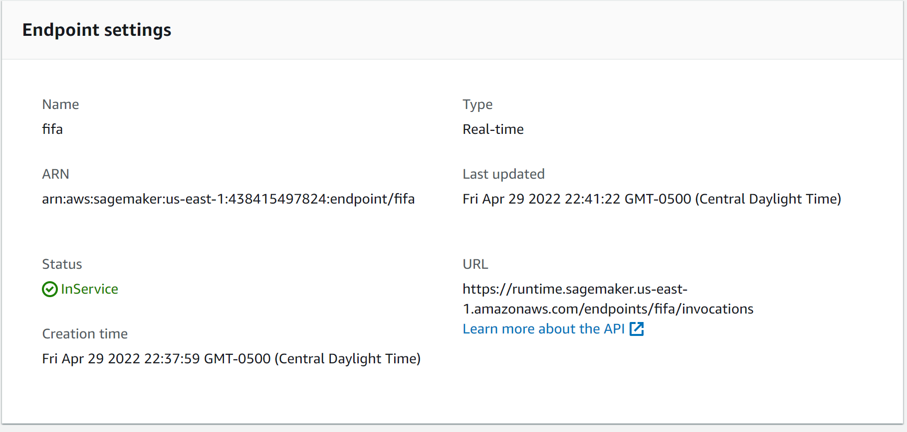
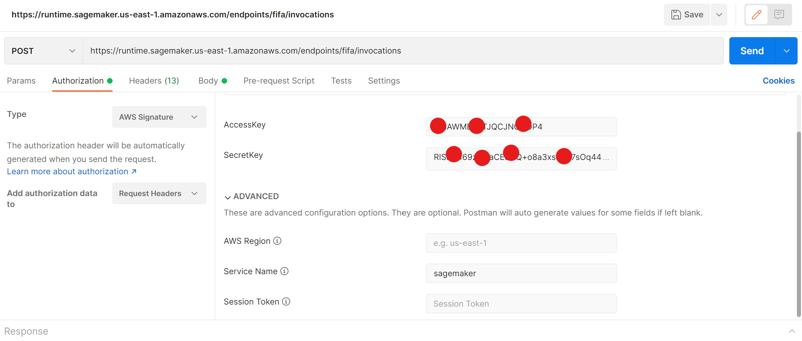
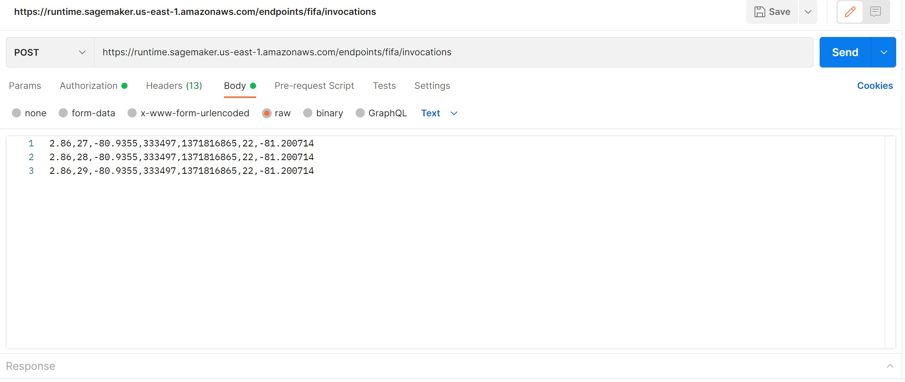
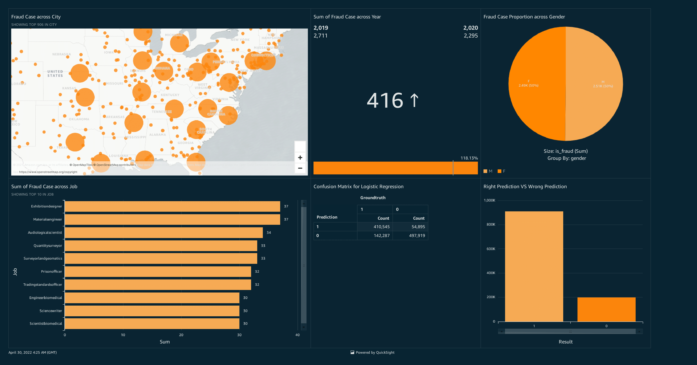

# Trends Marketplace 2022
**MSBA-6330 Group 7:** 
 
Grant Barland, Huiyan Xiong, Jacob Braun, Jiayi Wang, Ravi Hasyagar, Shuyun Liu

Fraud Detection Model and Visualization using AWS SageMaker, AWS QuickSight, and AWS S3

 

## Project Background
This project describes how Amazon S3, Amazon SageMaker and Amazon QuickSight can be utilized for **Fraud Detection**.

#### Why Fraud?

  

In 2021, credit card fraud grew to the largest ever, with 393,207 reports of credit card fraud filed. This poses a major risk for lenders and borrowers alike, and cloud based analytics are a great solution to uncover this problem.

## Dataset
https://www.kaggle.com/datasets/kartik2112/fraud-detection

This is a simulated credit card transaction dataset containing legitimate and fraud transactions from the duration 1st Jan 2019 - 31st Dec 2020. It covers credit cards of 1000 customers doing transactions with a pool of 800 merchants.

## Tools and Pipeline
In order to run the full gamut of data storage, data processing, and data visualization we needed to leverage three tools from the AWS ecosystem:

#### Built With
* [AWS SageMaker](https://aws.amazon.com/sagemaker/)
* [AWS QuickSight](https://aws.amazon.com/quicksight/)
* [AWS S3](https://aws.amazon.com/s3/)

#### Pipeline

  

#### Amazon S3
S3 is used in our pipeline as the data and model result storage solution that allows our sagemaker and quicksight tools to integrate with one another.
Folder structures can be created and files stored can be accessed by any AWS Ecosystem.
 
S3-Bucket Definition
 
 

  

 
S3 Folder Structure
 

  

#### Amazon Sagemaker
SageMaker is used as a Machine Learning tool using AWS cloud compute to build and run a fraud detection algorithm, using XGBoost, to help predict future fraud.
 
Sagemakers provides jupyter lab to build models and explore data using python and R. It provides sophisticated environments with packages from PyTorch to Tensorflow. It can also build automated models using XGB and provide end to end description of the data.
Check out: 'sagemaker/Exploratory Data Analytics.ipynb' and 'sagemaker/Model Training and Deployment.ipynb'

Once model is built, it can be deployed to create an endpoint, this endpoint can be used to access the model and get predictions.
 

  

 

 

  

  

#### Amazon QuickSight
Quicksight is the final stage of visualization and allows us to build a dashboard that interactively displays information about our dataset, and the fraud results from our model.

  

#### Conclusion
S3 provides stable data storage. Sagemaker can be used to create and deploy models very easily. Quicksight can be leveraged to generate dashboards and reports. All the 3 tools are easy to use and access.

#### Contact Us
**Email Ids:** 
barla049@umn.edu 
xion2190@umn.edu 
braun523@umn.edu 
wan00324@umn.edu 
liu01727@umn.edu 
hasya002@umn.edu 

(<a href="#top">back to top</a>)

